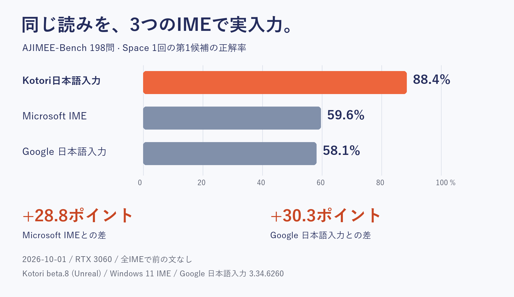

<h1 align="center">Kotori日本語入力</h1>

  <strong>AIで、日本語入力をもっと正確に。</strong> 
  Mozcをベースに、AIによる文脈理解で変換性能を大きく引き上げたWindows向け日本語IME。

  
  
  
  

<h2 align="center">
  <a href="https://github.com/aruiki/Kotori-AI-Japanese-IME/releases/latest/download/Kotori64.msi">⬇ Kotori日本語入力をダウンロード</a>
</h2>

  Windows 10 / 11・64bit

---

## AIで、従来のIMEより正確に

KotoriはMozcの変換候補にAIを組み合わせ、**文全体の意味から最も自然な変換を選び直します**。

単純な辞書変換では判断しにくい同音異義語や、前後の文章によって意味が変わる言葉でも、文脈に合った候補を選択します。

  

| 入力 | Mozc | Kotori |
| --- | --- | --- |
| かれはこうえんでこうえんをした | 彼は公園で公園をした | 彼は公園で**公演**をした |
| おんせいにんしきのせいどがあがった | 音声認識の制度が上がった | 音声認識の**精度**が上がった |
| あしたのかいぎはじゅうじからです | 明日の会議は従事からです | 明日の会議は**10時**からです |
| このやくはむずかしい | この薬は難しい | 文脈に応じて **この訳は難しい** |

直前に確定した文章も文脈として利用できます。

---

## 実入力ベンチマーク 88.4%

  

AJIMEE-Bench 198問を、**実際に各IMEへ入力して比較**しました。

| IME | 正解率 |
| --- | ---: |
| **Kotori日本語入力** | **88.4%** |
| Microsoft IME | 59.6% |
| Google 日本語入力 | 58.1% |

すべて同じ入力方法・同じ条件で、Spaceを1回押したときの第1候補を比較しています。

> この比較は2026-10-01時点の Kotori beta.8 / Unreal で測定したものです。  
> 現在版の再測定値ではありません。

評価方法・テストデータ・CSVは [eval/README.md](eval/README.md) で公開しています。

---

## Kotoriで変わること

  

**AIによる文脈変換**  
読みだけでは判断できない言葉も、文章全体から自然な候補を選びます。

**Spaceを押す前からAI予測**  
入力を止めると、AIが裏で変換と文章の続きを考えます。Tabから予測候補も選べます。

**完全オフライン**  
辞書もAIモデルもPC内にあります。入力した文章を外部サーバーへ送りません。

**Mozcベース**  
操作感、学習、ユーザー辞書はMozcをそのまま利用できます。

**GPUがなくても動作**  
専用GPUがないPCでは、自動的にCPU向けの設定へ切り替わります。

**使わないときはVRAMを解放**  
10分間入力がなければAIモデルをGPUから外し、VRAMを空けます。

---

## カタカナから英語にも変換

Kotoriには、カタカナ語から英語表記を選べる辞書も標準搭載しています。

| 入力 | 英語候補 |
| --- | --- |
| アーキテクチャ | `architecture` |
| アクセシビリティ | `accessibility` |
| コンフィギュレーション | `configuration` |
| レストラン | `restaurant` |

**31,068の読み・36,402組の英語表記**を収録しています。

日本語候補を残したまま英語表記も候補に追加されるため、辞書を切り替えたり、英語入力へ切り替えたりする必要はありません。

追加辞書のインポートも不要です。

---

## インストール

### 1. MSIをダウンロード

[**Kotori64.msi をダウンロード**](https://github.com/aruiki/Kotori-AI-Japanese-IME/releases/latest/download/Kotori64.msi)

### 2. インストーラーを実行

`Kotori64.msi` を開いてインストールします。

Windowsから「WindowsによってPCが保護されました」と表示された場合は、

**詳細情報 → 実行**

を選択してください。

### 3. Kotoriへ切り替える

インストール後、

**Windowsキー + Space**

から **Kotori日本語入力** を選択します。

これで使えます。

設定はデスクトップの **「Kotori日本語入力の設定」** から変更できます。

---

## 必要な環境

| | 必須 | おすすめ |
| --- | --- | --- |
| OS | Windows 10 1809以降 / 64bit | Windows 11 |
| メモリ | 8GB | 16GB |
| GPU | なくても動作 | Vulkan対応GPU / VRAM 3GB以上 |
| ディスク | 1.7GB | — |

NVIDIA / AMD / Intel Arc の専用GPUは自動検出します。

PythonやCUDAなど、AIを動かすための追加環境を自分でセットアップする必要はありません。

---

## AIを使っても、入力は軽く

通常のキー入力はMozcが処理するため、AIの計算完了を待ちません。

AIによる変換も処理時間に上限を設けており、間に合わない場合はMozcの結果をそのまま表示します。

  

RTX 3060環境のStandard設定では、AI変換1回の中央値は約 **0.06秒** です。

10分間日本語を入力しなければAIモデルをGPUから外し、使用していたVRAMも解放します。

---

## 仕組み

KotoriはMozcを置き換えるのではなく、**Mozcの高速で安定した日本語入力にAIを組み合わせて変換性能を高めます**。

  

1. **候補を作る**  
   Mozcと変換用AIから複数の候補を集めます。

2. **文脈から評価する**  
   AIが文章全体を見て、それぞれの候補がどれだけ自然か評価します。

3. **読みを確認する**  
   AIが生成した候補はMozcの辞書でも確認し、読みと一致しないものを除外します。

4. **最も自然な変換を表示する**  
   評価が最も高い候補をIMEの変換結果として表示します。

AIが読みにない単語を勝手に追加したり、ユーザー辞書へ登録した言葉を書き換えたりすることはありません。

詳しい設計は [docs/adr/](docs/adr/) にあります。

---

## 完全ローカル

KotoriのAIモデル、辞書、変換処理はすべてPC内で動作します。

**入力した文字を外部のAIサービスやサーバーへ送信しません。**

そのため、インターネット接続がなくてもAI変換を利用できます。

---

## 困ったとき

使い方、アンインストール、データの保存場所、トラブル対処は

[**使い方と困ったとき**](docs/USER_GUIDE.md)

にまとめています。

不具合・誤変換・要望は [Issues](https://github.com/aruiki/Kotori-AI-Japanese-IME/issues/new/choose) へお願いします。

---

## 開発者向け

- [開発方法](docs/DEVELOPMENT.md)
- [評価方法](eval/README.md)
- [性能測定](docs/PERFORMANCE.md)
- [設計記録](docs/adr/)
- [仕様](docs/SPEC.md)
- [開発規約](AGENTS.md)

---

## 開発を支援する

Kotoriは無料のオープンソースソフトウェアとして開発しています。

[**Stripeから開発を支援する**](https://buy.stripe.com/cNi14m7jRdq005f0781ZS08)

支援の有無による機能制限はありません。

---

## ライセンス

Kotoriのコードは **Apache License 2.0 / MIT License** のデュアルライセンスです。

Mozcへの変更はBSD-3-Clauseです。

同梱コンポーネントを含む詳細は [docs/licenses.md](docs/licenses.md) を参照してください。

---

<h2 align="center">
  <a href="https://github.com/aruiki/Kotori-AI-Japanese-IME/releases/latest/download/Kotori64.msi">⬇ Kotori日本語入力を試す</a>
</h2>

  Windows 10 / 11・無料・完全オフライン・GPUなしでも利用可能

