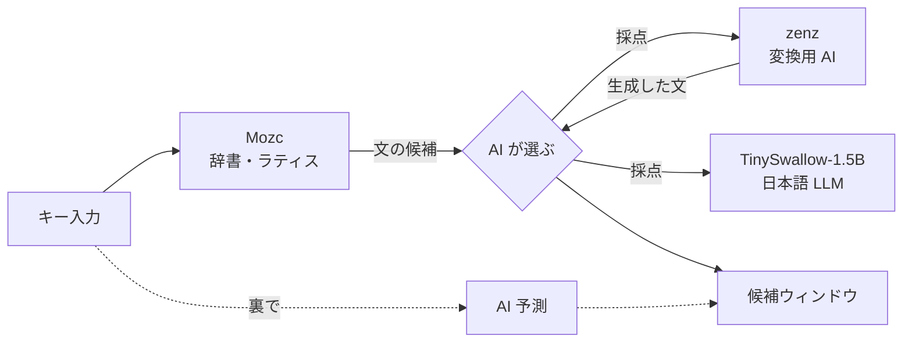

<h1 align="center">Kotori日本語入力IME</h1>

文脈をAIが読み変換先を最適化する次世代IME

  
  
  
  
  
  

<h3 align="center">
  <a href="https://github.com/aruiki/KotoriIME-japanese-/releases/download/v1.1.0/Kotori64.msi">⬇ 正式版 v1.1.0 をダウンロード</a>
</h3>

  <a href="https://github.com/aruiki/KotoriIME-japanese-/releases/latest">正式版のダウンロード</a> ・
  <a href="https://github.com/aruiki/KotoriIME-japanese-/releases">すべてのリリース</a>

  <a href="#変換の例">変換の例</a> ・
  <a href="#変換の正確さ">正確さ</a> ・
  <a href="#ほかの-ime-と比べる">ほかの IME と比較</a> ・
  <a href="#入力中の-ai-予測">AI 予測</a> ・
  <a href="#軽さ">軽さ</a> ・
  <a href="#しくみ">しくみ</a> ・
  <a href="#必要な環境">必要な環境</a> ・
  <a href="#インストール">インストール</a> ・
  <a href="#よくある質問">よくある質問</a>

---

## ほかの IME と比べる

AJIMEE-Benchの198問で、Kotoriの正解率は88.4%、Microsoft IMEは59.6%、Google日本語入力は58.1%でした。差はそれぞれ28.8、30.3ポイントです。

2026-10-01、RTX 3060。Kotoriは **beta.8 / Unreal**、Microsoft IMEは **Windows 11付属版**、
Google日本語入力は **3.34.6260**。以下はこの版・環境での測定値で、現在のv1.0.0 / v1.1の再測定ではありません。

Google 日本語入力と Microsoft IME には変換だけを呼び出す方法がないので、**実際に IME で入力して**測りました。
読みをキーで打ち、Space で変換、Enter で確定した文字を正解と比べます。3 つとも同じ道具・同じ条件です
([eval/imebench/](eval/imebench/))。公開済みの結果は[CSVでも取得できます](eval/imebench/comparison-2026-10-01.csv)。

| | AJIMEE-Bench (198問) | 日常の文 (81問) | 同音語 (40問) | 人名・地名・新語 (40問) | 打ち間違い (40問) |
| --- | ---: | ---: | ---: | ---: | ---: |
| **Kotori日本語入力 beta.8**(Unreal) | **88.4%** | **97.5%** | **97.5%** | **97.5%** | 5.0% |
| Microsoft IME | 59.6% | 86.4% | 82.5% | 82.5% | 5.0% |
| Google 日本語入力 | 58.1% | 81.5% | 65.0% | 95.0% | 10.0% |

### AJIMEE-Benchでは、どんな文を変換する？

単語を知っているだけでなく、文の意味に合う漢字を選ぶ必要があります。実際の評価データから3問を抜粋しました。

| 問題ID | 読み（原文） | 許容される正解の一例 | 難しさ |
| --- | --- | --- | --- |
| 1890 | カケイヲタスケルタメ、リョウシュノイエニホウコウシ | 家計を助けるため、領主の家に奉公し | 「かけい」「りょうしゅ」「ほうこう」を、家計・領主・奉公として文全体で選ぶ。 |
| 1982 | シュウシカテイホケンカガク | 修士課程保健科学 | 「しゅうしかてい」「ほけんかがく」を、大学院の修士課程・保健科学として選ぶ。 |
| 2128 | ノケッカ、ジャッカンジュウサンサイニシ | の結果、弱冠１３歳にし | 「じゃっかん」は、年齢を述べるこの文では「若干」ではなく「弱冠」。数字表記の許容解もある。 |

これは問題の難しさを示すための例で、Microsoft IME・Google日本語入力・Kotoriの個別の出力結果を示すものではありません。上の実入力比較は全198問の集計です。

出典: [azooKey/AJIMEE-Bench](https://github.com/azooKey/AJIMEE-Bench/blob/401666cd56d1a570c2021798b64b6da4396bfd45/JWTD_v2/v1/evaluation_items.json)（元データ: [日本語Wikipedia入力誤りデータセット v2](https://nlp.ist.i.kyoto-u.ac.jp/?日本語Wikipedia入力誤りデータセット)）。読み・正解は [CC BY-SA 3.0](https://creativecommons.org/licenses/by-sa/3.0/) の抜粋、文は原文のまま。難しさの説明は当プロジェクトによるものです。

- 全IMEで前の文なし、Space 1回の第1候補。NFKCで表記を揃え、AJIMEEの入力できない2問は除外しています。
- 学習は各IMEの既定設定のままです。フォーカスとテキストを問ごとにリセットしています。
- 下の91.5〜93.0%は前の文を渡す別の評価です。この3製品比較とは条件・問題数が違います。
- 同音語・人名・打ち間違いのセット(各 40 問)は、このプロジェクトで作ったものです([eval/sets/](eval/sets/))。
- **打ち間違いの補正**(「ありがとうごさいます」→「ありがとうございます」など)は、どの IME もほとんどできません。
  このセットではKotoriはMicrosoft IMEと同率で、Google日本語入力を下回りました。改善を進めています。
- ATOK は手元にないため測っていません。

## 変換の例

表で見る(コピーできる形)

実際の出力です(Standard、2026-10-01)。「前の文」は、直前に確定した文として AI に渡したものです。

| 読み | 前の文 | Mozc 単体 | Kotori日本語入力 |
| --- | --- | --- | --- |
| かれはこうえんでこうえんをした | | 彼は公園で公園をした | 彼は公園で**公演**をした |
| おんせいにんしきのせいどがあがった | | 音声認識の制度が上がった | 音声認識の**精度**が上がった |
| あしたのかいぎはじゅうじからです | | 明日の会議は従事からです | 明日の会議は**１０時**からです |
| このやくはむずかしい | 英語の文を日本語にしています。 | この薬は難しい | この**訳**は難しい |
| いしをつたえる | 自分の | 医師を伝える | **意思**を伝える |
| ここではきものをぬいでください | 玄関で靴を脱いで。 | ここでは着物を脱いでください | **ここで履物**を脱いでください |

## 変換の正確さ

この節は変換器を直接呼ぶ評価です。前の文を渡すため、上のMicrosoft IME・Google日本語入力との実入力比較とは分けてご覧ください。

- [AJIMEE-Bench](https://github.com/azooKey/AJIMEE-Bench) は、かな漢字変換の難しい 200 問(同音異義語、文脈で
  決まる語など)の評価セットです。1 番目の候補が正解と一致した割合を数えています。
- 調整に一度も使っていない **最終評価用のセット 300 問**(ニュース・ビジネス・日常・固有名詞・数字など)では、
  Mozc 単体 82.3% → **96.3%**(Standard)。過学習していないかの確認に使っています。
- 測り方と記録はすべて [eval/README.md](eval/README.md) にあります。

## 入力中の AI 予測

入力している間、AI が文の続きを裏で考え、次の打鍵のときに候補の先頭に「AI」と付けて出します。
Tab で予測の候補に移って選べます。

**手を止めると、Space を押す前に AI の変換が出ます**(v1.1)。打ち終わって手を止めると、候補の先頭が Space を押したときと
同じ AI の変換(「彼は公園で公園をした」ではなく「彼は公園で**公演**をした」)に変わり、裏で作った文の続きも並びます。
Space を押すと、そのまま同じ変換になります。

| | Mozc 単体 | Kotori日本語入力 |
| --- | ---: | ---: |
| 決まった言い回し 29 問で、正しい続きが上位 3 件に出た割合 | 17.2% | **58.6%** |
| 1 打鍵の応答 | 1〜3 ms | 1〜3 ms(予測は裏で計算し、打鍵を待たせない) |
| 手を止めてから Tab | — | 約 0.04 秒 |

入力の邪魔になるだけの予測(脱線した文、読みを写しただけのカタカナ、1 文字だけの続き)は出しません。

## 軽さ

- **入力中の GPU の負荷**: 前の打鍵の計算を使い回し、まとめて計算することで、AI が GPU を使う時間を約 4 割減らしました。
- **使っていないとき**: 10 分入力がなければ AI のモデルを外し、VRAM を空けます(ゲームや動画の編集の邪魔をしない)。
  次に入力すると裏で読み込み直します。
- **固まらない**: 変換で AI に使う時間には上限があり、間に合わなければ Mozc の結果をそのまま出します。
  内蔵 GPU には AI を載せません(反応が遅く、入力が止まるため)。

## カタカナ語から英語を選ぶ

v1.1.0-rc.4には、**31,068の読み・36,402組の英語表記**を含む辞書を組み込んでいます。
アーキテクチャ → architecture、アクセシビリティ → accessibility、コンフィギュレーション → configuration、
レストラン → restaurantなどを候補から選べます。辞書の手動インポートは不要です。
日本語の先頭候補を保持し、同じ読みで綴りが分かれる場合も選択肢を残します。

出典は[KEINOSのカタカナ語英字辞典](https://github.com/KEINOS/google-ime-user-dictionary-ja-en)で、
収録データを検査・加工して使っています。変更済みデータと出典・ライセンス情報をMSIへ同梱しています。
辞書データはCC BY-SA 3.0です。詳しくは[rc.4のリリースノート](https://github.com/aruiki/KotoriIME-japanese-/releases/tag/v1.1.0-rc.4)を参照してください。

## しくみ

1. **候補を集める**: Mozc が辞書から文を組み立て、変換用の小さな AI(zenz)も読みから文を書きます。
2. **AI が選ぶ**: zenz と日本語の言語モデル(TinySwallow-1.5B)が、「前の文に続けて自然な日本語か」を
   それぞれ点数にします。点数の合計がいちばん高い文を選び、文節の区切りもそれに合わせます。
3. **辞書で確かめる**: AI が書いた文は、読みと合っているかを Mozc の辞書で確かめ、合わないものは捨てます。
   AI が読みにない語を足したり、読みを落としたりすることはありません。

AI が働くのは変換(Space)と予測のときだけで、1 文字ずつの入力はこれまでどおり Mozc が処理します。
ユーザー辞書に登録した語は、AI が書き換えません。詳しい設計は [docs/adr/](docs/adr/) にあります(0012 以降)。

## 設定

## 必要な環境

| | 最低限 | おすすめ |
| --- | --- | --- |
| OS | Windows 10 1809 以降(64 bit) | Windows 11 |
| GPU | なくても動く(自動で Low) | 専用 GPU、Vulkan 対応、VRAM 3 GB 以上(NVIDIA / AMD / Intel Arc) |
| メモリ | 8 GB | 16 GB |
| ディスク | 1.7 GB | |

GPU は自動で見つけて使います。ドライバー以外の準備は要りません。内蔵 GPU(CPU に付いている GPU)は使わず、
その場合は CPU で動きます。動作を確かめた GPU は RTX 3060 です。

### 品質の段階

設定の「AI 変換」タブで選べます。数値は RTX 3060(GPU のない PC の行はデスクトップの CPU)で測りました。

| 品質 | AJIMEE-Bench | 変換 1 回(中央値) | VRAM | 向いている環境 |
| --- | ---: | ---: | ---: | --- |
| Low | 88.0% | 0.06 秒 | 約 0.5 GB | GPU が小さい |
| **Standard(既定)** | **91.5%** | **0.06 秒** | 約 1.5 GB | GPU あり |
| High | 92.5% | 0.08 秒 | 約 1.5 GB | 速い GPU |
| Unreal | 93.0% | 0.26 秒 | High より多い | とても速い GPU |
| (GPU のない PC) | 83.0% | 0.12〜0.16 秒 | — | ノート PC。どの品質を選んでも自動でこれ |

## インストール

1. [Releases](https://github.com/aruiki/KotoriIME-japanese-/releases/latest) から `Kotori64.msi` をダウンロードして実行します
   (管理者の確認で「はい」)。「Windows によって PC が保護されました」と出たら「詳細情報」→「実行」。
2. 入力方式に **Kotori日本語入力** が加わります。Windows キー + Space で切り替え、半角/全角キーでオン/オフ。
3. 設定はデスクトップの「Kotori日本語入力の設定」から開けます。

新しい版は、前の版の上にそのまま入れられます(v0.3.0-beta.6 以降)。それより前の版が入っているときは、
一度アンインストールしてから入れてください。アンインストールは「設定」→「アプリ」から行えます。

使い方、データの置き場、アンインストールで残るもの、困ったときの対処は **[使い方と困ったとき](docs/USER_GUIDE.md)** に
まとめています。不具合・誤変換は [Issues](https://github.com/aruiki/KotoriIME-japanese-/issues/new/choose) へ、
セキュリティの問題は [SECURITY.md](SECURITY.md) の方法で知らせてください。

## 最近の更新

| 版 | 主な変更 |
| --- | --- |
| [v1.1.0-rc.3](https://github.com/aruiki/KotoriIME-japanese-/releases/tag/v1.1.0-rc.3)(リリース候補) | 折り紙の小鳥のアイコン、設定・辞書のアイコン、インストーラーの背景を更新 |
| [v1.1.0-rc.2](https://github.com/aruiki/KotoriIME-japanese-/releases/tag/v1.1.0-rc.2)(リリース候補) | 最初の候補をAIの評価後に表示。モデル準備中の結果を覚えてしまう問題を修正し、候補欄の余白・選択色・文字種候補の表示を整理 |
| [v1.1.0-rc.1](https://github.com/aruiki/KotoriIME-japanese-/releases/tag/v1.1.0-rc.1)(リリース候補) | **手を止めると、Space を押す前に AI の変換が出る**。Tab の予測も手を止めると出る |
| [v1.0.0](https://github.com/aruiki/KotoriIME-japanese-/releases/tag/v1.0.0) | **最初の公開版**(署名は 1.0.x で付ける)。診断情報の書き出し、落ちたときの記録(入力した文字は含まない)、通信の部品を外した、第三者の表示 |
| [v0.3.0-beta.8](https://github.com/aruiki/KotoriIME-japanese-/releases/tag/v0.3.0-beta.8) | GPU のない PC で、長い文の変換が速く正確に(打ってすぐ Space の正解 36 → 46 / 60 文) |
| [v0.3.0-beta.7](https://github.com/aruiki/KotoriIME-japanese-/releases/tag/v0.3.0-beta.7) | 10 分使わなければ VRAM を空ける。入力中の GPU の負荷をさらに約 1 割減 |
| [v0.3.0-beta.6](https://github.com/aruiki/KotoriIME-japanese-/releases/tag/v0.3.0-beta.6) | 上書きインストール、予測が邪魔になりにくく、Unreal 93.0%、VRAM 約 170 MB 減 |
| [v0.3.0-beta.5](https://github.com/aruiki/KotoriIME-japanese-/releases/tag/v0.3.0-beta.5) | ノート PC で固まらない、GPU のない PC 向けの Low、設定画面の不具合の修正 |

すべての版は [Releases](https://github.com/aruiki/KotoriIME-japanese-/releases) にあります。

## よくある質問

<b>インターネットにつながりますか?</b>

つながりません。辞書も AI も PC の中にあり、入力した文字を外に送りません。AI が覚えておく予測は
シークレットモード(プライベートな入力)では作らず、使わないときは捨てます。

<b>Google 日本語入力や Mozc と何が違いますか?</b>

操作と辞書は Mozc と同じです。その上で、変換の最後に AI が文脈を見て候補を選び直し、入力中に文の続きを
予測します。Kotori日本語入力は Google が提供・推奨するものではありません。

<b>GPU がないと使えませんか?</b>

使えます。GPU がない PC(内蔵 GPU だけの PC を含む)では、どの品質を選んでも自動で CPU 向けの設定になります
(AJIMEE-Bench 83.0%、日常の文 97.5%)。AI が時間内に終わらないときは Mozc の結果を出すので、入力が固まりません。

<b>ゲーム中に VRAM を取られませんか?</b>

日本語を 10 分入力しなければ、AI のモデルを外して VRAM を空けます。次に入力したときに裏で読み込み直します
(その最初の 1 回だけ、AI なしの変換になることがあります)。

<b>AI の状態はどこで見られますか?</b>

設定の「AI 変換」タブに、使っている GPU と、実際に動いている AI(読み込み中・休んでいる・動いていない理由)が出ます。

<b>学習やユーザー辞書は使えますか?</b>

Mozc の学習とユーザー辞書がそのまま使えます。ユーザー辞書に登録した語は、AI が書き換えません。

ほかの症状と対処は [使い方と困ったとき](docs/USER_GUIDE.md#困ったとき) にあります。

## 開発を支援する

Kotoriは無料のオープンソースとして開発しています。[Stripeの開発支援ページ](https://buy.stripe.com/cNi14m7jRdq005f0781ZS08)から支援できます。
支援の有無によって機能を制限することはありません。

## 開発者向け

- 現状と次の作業: [docs/HANDOFF.md](docs/HANDOFF.md)、作業カード: [docs/tasks/](docs/tasks/)
- Mozc への変更とビルド方法: [mozc/README.md](mozc/README.md)、[docs/DEVELOPMENT.md](docs/DEVELOPMENT.md)(Bazel、パッチ 3 本)
- 精度の評価: [eval/README.md](eval/README.md)、性能: [docs/PERFORMANCE.md](docs/PERFORMANCE.md)
- 設計の記録: [docs/adr/](docs/adr/)、仕様: [docs/SPEC.md](docs/SPEC.md)、開発規約: [AGENTS.md](AGENTS.md)
- README の画像は `python docs/images/gen_readme_images.py` で作り直せます。
- Rust 版(以前の実装、参考として残す)は `cargo install just` のあと `just ci` でテストできます。

## ライセンス

このリポジトリのコードは Apache License 2.0 または MIT License のいずれかを選べます([LICENSE-APACHE](LICENSE-APACHE)、
[LICENSE-MIT](LICENSE-MIT))。Mozc への変更は Mozc と同じ BSD-3-Clause です。同梱するものは次のとおりです
(詳しくは [docs/licenses.md](docs/licenses.md))。

- Mozc: BSD-3-Clause(Google Inc.)
- zenz-v2.5-small・medium: CC BY-SA 4.0(Keita Miwa)
- TinySwallow-1.5B: Apache-2.0(Sakana AI)
- llama.cpp / ggml: MIT、Qt 6: LGPL-3.0

アイコンと README の画像の文字には Noto Serif JP / Noto Sans JP(SIL Open Font License)を使っています。
