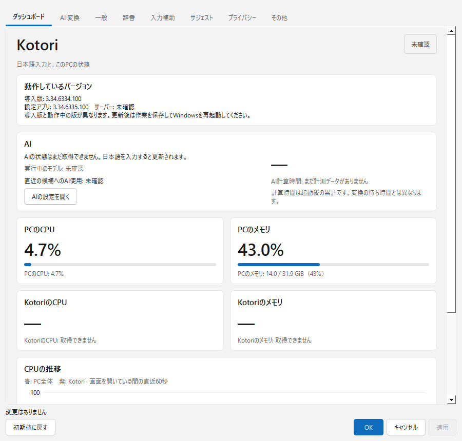

# 動作状態と軽量更新のローカル検証（2026-10-10）

## 状態表示

導入ファイル（サーバー）の版、現在の設定アプリのコンパイル版、起動PID/作成時刻/実行パスを確認したサーバー自身の版を区別する。
稼働版の不一致では再起動を案内し、未取得を一致・成功と扱わない。全アプリの読み込み済みTIPを確認したとの表示はしない。

モデルの準備完了と、直近の先頭候補にAI評価を使用できたことを別々に表示する。
Sessionで未評価候補を隠した後の出力を記録し、隠している候補を表示済みと数えない。
クライアントの描画完了の確認ではない。同期側はatomicの種類と時刻のみ。文・読み・候補文字列を保存しない。
AI無効・シークレット・保護欄では状態を消去する。既存ワーカーが変化を2秒ごとに拾い、ファイル書込みを行う。
モデル解放確認は従来と同じ30秒間隔。モデル・生成/採点・候補採用条件は変更しない。

ローカルの5対象、合計343テストが通過。最後の説明文の修正後はbase/GUIを再実行し成功。
GUIは初回offscreenでフォントが不足したため、Windowsプラットフォームで再確認した。
初回GUIテストのDLL不足と、誤ったshellパスでのbuild失敗は私的ログに保持し、成功へ書き換えない。

設定サービスはmock、ユーザープロファイルはテスト用。見せかけの0%、未取得版の一致、AI候補使用の成功を表示しない。
serverとtoolのローカルbuild成功、実ファイル版3.34.6335.100。118入力が正本/cache/新規cloneで一致、パッチ適用成功。
新MSIのbuild/導入/実入力は未実施。利用者は再起動してから確認することを選択したが、再起動完了は未観測。

## 軽量更新の試作

既存の6333→6334をWiX MSPでローカル生成した。元のMSIを変更せず、私的な更新imageのみProductCodeをbaselineへ揃える。
21,921,792bytes（約21.9MB / 20.9MiB）。full MSIの1,569,173,504bytesに対し約98.6%小さい。
読み取りによるcabinet検査でpayloadは7プログラム、GGUFなし。3モデルのハッシュは元/先で同一。
対象ProductCode/UpgradeCode/言語/先頭3版をtransformでEqual照合。実環境の対象外版拒否の動作はまだ未確認。
同じMSIやモデル変更の入力は、出力を作る前に拒否した。元MSIのSHAが不変であることを再確認。

これは公開更新ではない。現PCは既に6334なのでこの試作を導入しない。
実機の更新/取消し/rollback、変更されたモデルの検出、パッチ後の通常MSIへの移行は未検証。
全てのProductCodeを常時同じにする変更や、Program Filesへの手動上書きは採用しない。

Windows Installerのパッチについては[WiX公式手順](https://docs.firegiant.com/wix/tools/patches/)に従う。
厳密な版の照合は[Validateの定義](https://docs.firegiant.com/wix/schema/wxs/validate/)で確認した。

詳細は同名JSONとsmall-update-prototype-20261010.json。raw MSIログ・利用者の文・履歴・認証情報は公開記録に含めない。
